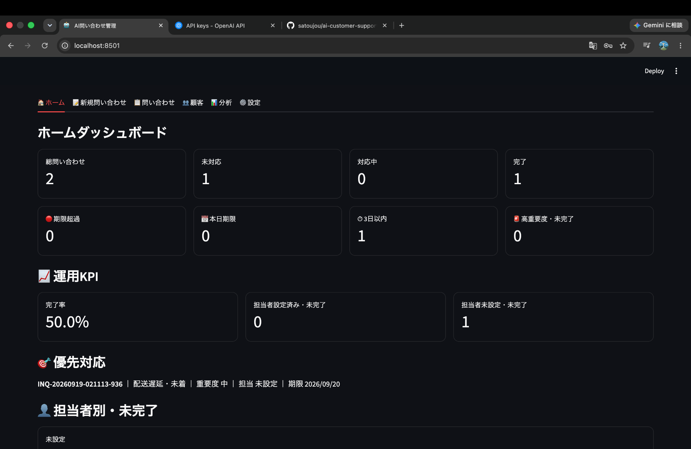
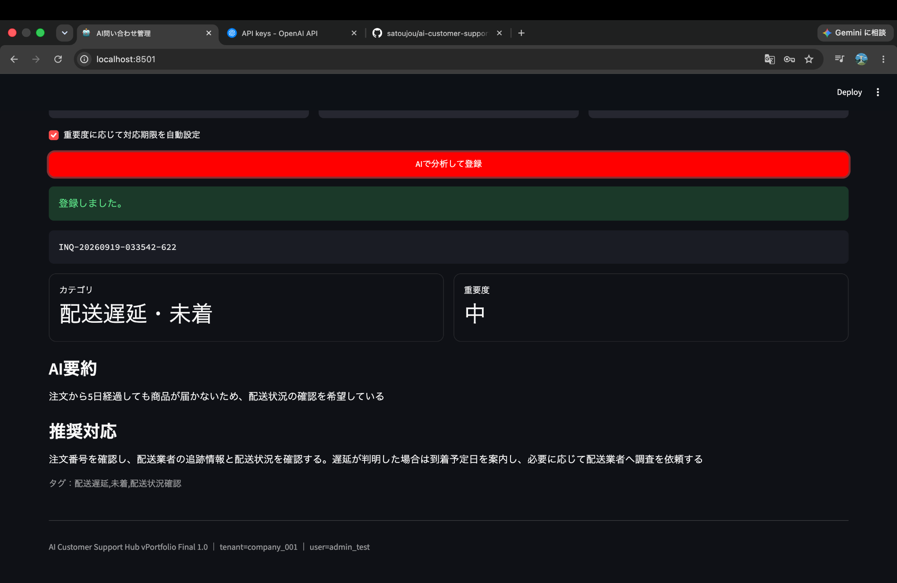
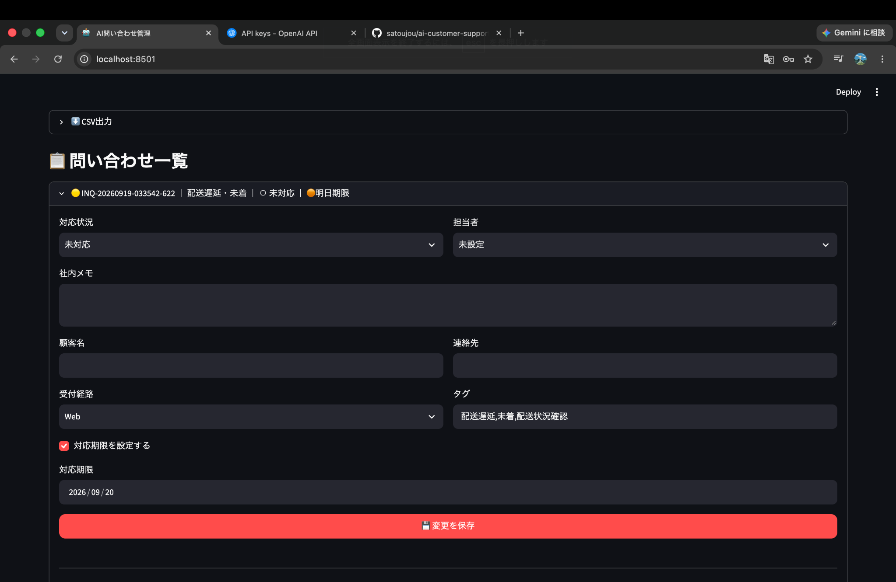
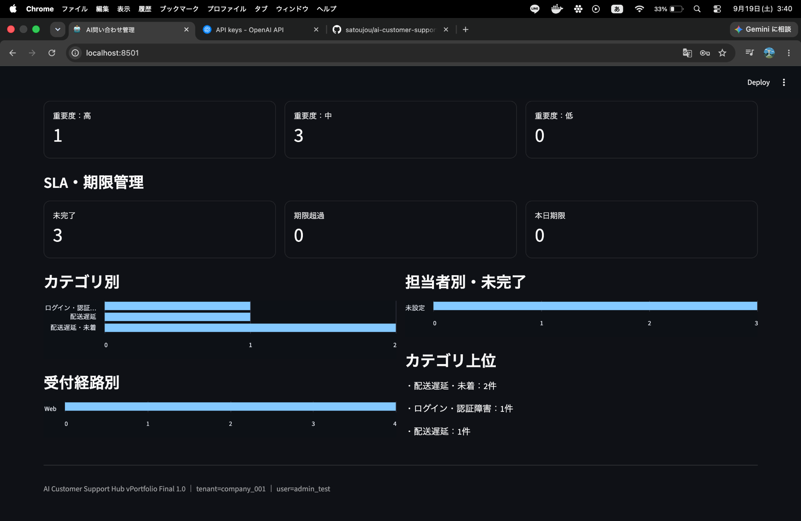
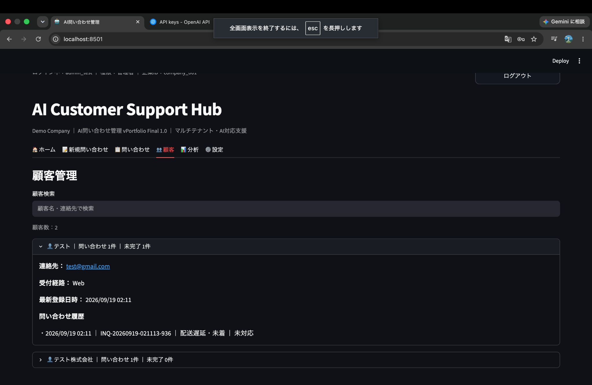

# AI Customer Support Hub

AIを活用して問い合わせ内容を分析・構造化し、対応期限・担当者・顧客情報・SLA・監査ログまで一元管理する、マルチテナント型カスタマーサポートSaaSのポートフォリオです。

Python / Streamlit / PostgreSQL / Docker / OpenAI APIを使用して、問い合わせ受付からAI分析、対応管理、顧客管理、分析までの一連の業務フローを実装しています。

> **Portfolio / Demo Project**

## 🌐 Live Demo

https://ai-customer-support-hub-production.up.railway.app/
  
> 本リポジトリはポートフォリオ・デモ用途として作成しています。

---

## 📊 Home Dashboard



問い合わせ件数・対応状況・期限・重要度などを集約し、現在のサポート状況を一画面で確認できるダッシュボードです。

### 主な表示内容

- 総問い合わせ数
- 未対応 / 対応中 / 完了
- 期限超過 / 本日期限 / 3日以内
- 高重要度かつ未完了の問い合わせ
- 完了率
- 担当者設定状況
- 優先対応対象

問い合わせデータの登録・更新内容がダッシュボードへ反映される設計にしています。

---

## 🤖 AI Inquiry Analysis



入力された問い合わせをOpenAI APIで分析し、サポート業務で利用できる構造化データへ変換します。

### AIによる分析項目

- カテゴリ分類
- 重要度判定
- 問い合わせ内容の要約
- 推奨対応の生成
- タグ生成
- AI返信案の生成

AIの出力をそのまま顧客へ自動送信するのではなく、人が内容を確認して利用する **Human-in-the-loop** の設計としています。

重要度に応じて対応期限を設定し、AI分析結果を問い合わせ管理へ連携します。

---

## 📋 Inquiry Management



AIで分析・登録した問い合わせを、実際のカスタマーサポート業務として管理する画面です。

### 管理できる情報

- 対応状況
- 担当者
- 社内メモ
- 顧客名
- 連絡先
- 受付経路
- タグ
- 対応期限

問い合わせの更新内容はデータベースへ保存され、ダッシュボード・分析・顧客管理などへ反映されます。

また、問い合わせデータのCSVエクスポートにも対応しています。

---

## 📈 Analytics & SLA Monitoring



蓄積された問い合わせデータを集計し、サポート業務の状況を可視化します。

### 分析項目

- 未対応 / 対応中 / 完了
- 重要度別件数
- SLA・期限管理
- カテゴリ別問い合わせ件数
- 担当者別未完了件数
- 受付経路別件数
- カテゴリ上位

単なる問い合わせ管理だけでなく、蓄積データを運用改善へ活用できる構成を意識しています。

---

## 👥 Customer Management



問い合わせを顧客単位で集約し、過去の問い合わせ履歴を確認できます。

### 顧客単位で確認できる情報

- 問い合わせ件数
- 未完了件数
- 連絡先
- 受付経路
- 最新登録日時
- 問い合わせ履歴

AI分析した問い合わせを単発で処理するだけではなく、顧客情報と紐付けて継続的に管理できるようにしています。

---

## ✨ Main Features

- OpenAI APIによる問い合わせ分析
- カテゴリ分類・重要度判定・要約・推奨対応・タグ生成
- AI返信案生成
- Human-in-the-loop設計
- 問い合わせ検索・絞り込み
- ステータス管理
- 担当者管理
- 対応期限管理
- 社内メモ
- SLAダッシュボード
- 顧客単位の問い合わせ履歴
- カテゴリ・受付経路・担当者別分析
- Role-Based Access Control（RBAC）
- マルチテナントデータ分離
- 企業作成・停止 / 再開
- 監査ログ
- CSVエクスポート
- PostgreSQLによる永続化
- Docker Composeによる実行環境構築

---

## 🏢 Multi-Tenant Architecture

企業ごとにデータを分離するマルチテナント構成を実装しています。

問い合わせ・ユーザー・監査ログなどのデータを企業IDでスコープし、ログイン中の企業とは異なる企業のデータが表示されないようにしています。

プラットフォーム管理者から企業の作成や利用状態の管理を行うこともできます。

---

## 🔐 Authentication & Authorization

ユーザー認証に加えて、役割ごとに利用可能な操作を制御しています。

### Roles

- **Administrator** — 管理機能を含む操作
- **Agent** — 問い合わせ対応・更新
- **Viewer** — 閲覧中心のアクセス

パスワードはbcryptでハッシュ化して保存します。

---

## 🧾 Audit Logging

問い合わせやシステム上の操作を追跡できるよう、監査ログ機能を実装しています。

業務システムとして「誰が・どの企業で・どの操作を行ったか」を確認できる構成を意識しています。

---

## 🛠 Tech Stack

| Category | Technology |
|---|---|
| Language | Python 3.12 |
| UI | Streamlit |
| Database | PostgreSQL 16 |
| PostgreSQL Driver | psycopg 3 |
| AI | OpenAI API |
| Authentication | bcrypt |
| Data Processing | pandas |
| Container | Docker / Docker Compose |
| Version Control | Git / GitHub |

---

## 🏗 Project Structure

```text
.
├── app.py
├── auth.py
├── bootstrap.py
├── database.py
├── main.py
├── Dockerfile
├── docker-compose.yml
├── requirements.txt
├── .env.example
├── .gitignore
├── README.md
└── docs/
    └── images/
        ├── 01_dashboard.png
        ├── 02_ai_analysis.png
        ├── 03_inquiry_management.png
        ├── 04_analytics.png
        └── 05_customer_management.png
```

### Main Files

- `app.py` — Streamlit UI、権限制御、テナント境界、各管理画面
- `auth.py` — PostgreSQL認証・RBAC
- `database.py` — DBスキーマ・テナントスコープ付きデータアクセス
- `main.py` — AI分析・問い合わせ登録 / 更新ロジック
- `bootstrap.py` — 初回企業・管理者作成
- `docker-compose.yml` / `Dockerfile` — 実行環境

---

## 🚀 Setup

### 1. Environment Variables

`.env.example` を `.env` にコピーします。

```bash
cp .env.example .env
```

`.env` にOpenAI APIキー、データベースパスワード、初期管理者情報など必要な環境変数を設定します。

### 2. Start PostgreSQL

```bash
docker compose up -d db
```

### 3. Bootstrap

初回のみ企業・管理者を作成します。

```bash
docker compose run --rm app python bootstrap.py
```

### 4. Start Application

```bash
docker compose up -d --build
```

ブラウザで以下を開きます。

```text
http://localhost:8501
```

---

## 🔒 Security Design

以下の情報はGit管理対象外としています。

- `.env`
- 認証情報
- APIトークン
- ログ
- バックアップ

その他、以下の点を考慮しています。

- パスワードのbcryptハッシュ化
- SQLプレースホルダの利用
- 企業IDによるデータスコープ
- Role-Based Access Control
- AI返信の自動送信を行わないHuman-in-the-loop設計
- 秘密情報を環境変数から取得

---

## 🧪 Demo Flow

デモでは以下の流れを確認できます。

1. ログイン
2. 問い合わせ内容を入力
3. AIによる分類・重要度判定・要約・推奨対応
4. 問い合わせとして登録
5. ステータス・担当者・期限などを更新
6. ダッシュボードへ反映
7. 顧客単位の履歴を確認
8. 分析画面で問い合わせデータを集計
9. ロールごとの操作権限を確認
10. 別企業でログインし、テナント分離を確認

---

## ⚠️ Production Considerations

本リポジトリはポートフォリオ / デモ用途です。

本番環境で提供する場合には、環境要件に応じて以下の追加を想定しています。

- TLS / HTTPS
- Managed PostgreSQL
- Secret Manager
- Backup / Disaster Recovery
- Rate Limiting
- Monitoring / Alerting
- SSO / Identity Provider Integration
- CI/CD
- セキュリティ監査

---

## 🎯 Project Goal

このプロジェクトでは、単純にOpenAI APIを呼び出すだけではなく、

**AIによる問い合わせ理解 → 構造化 → 業務管理 → SLA管理 → 顧客履歴 → データ分析**

までを一つのシステムとしてつなげることを目標としました。

AIを既存業務の一部分として組み込み、人が確認・判断しながら利用できる業務アプリケーションの設計を意識しています。